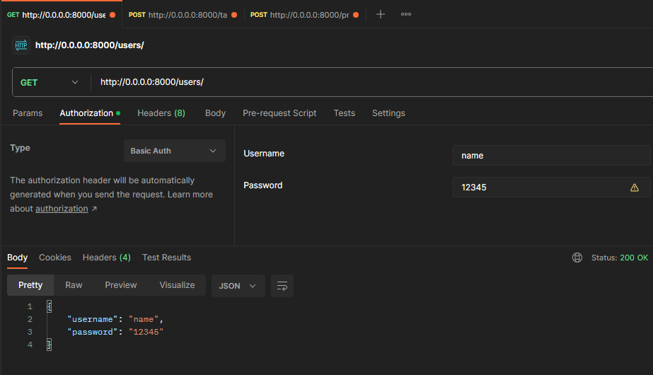
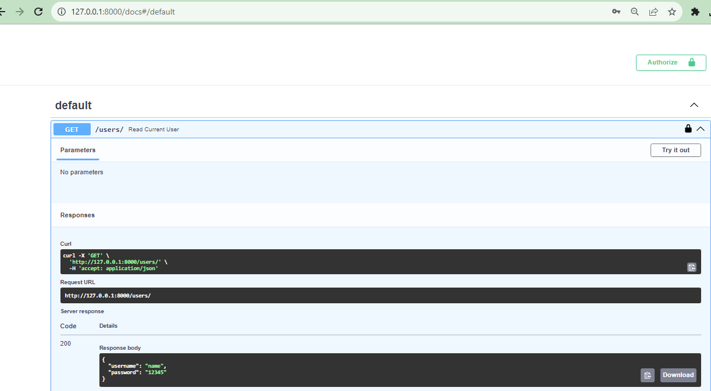
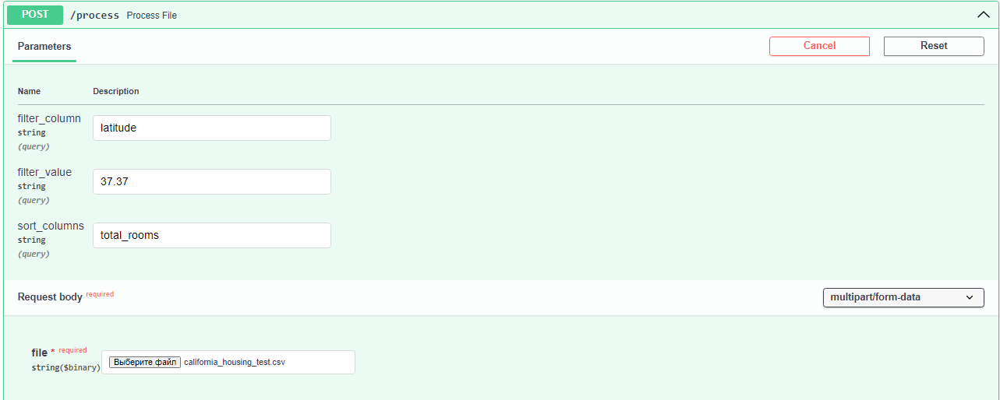
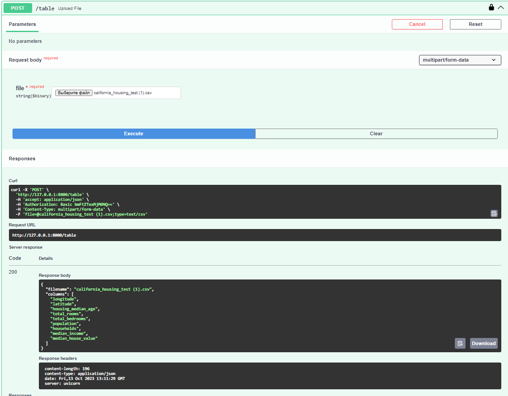
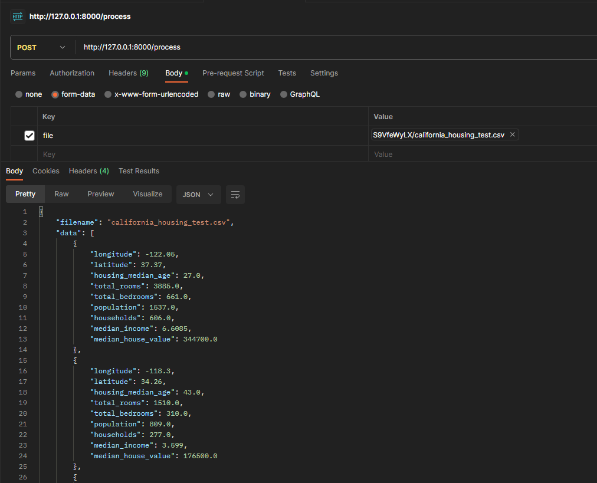
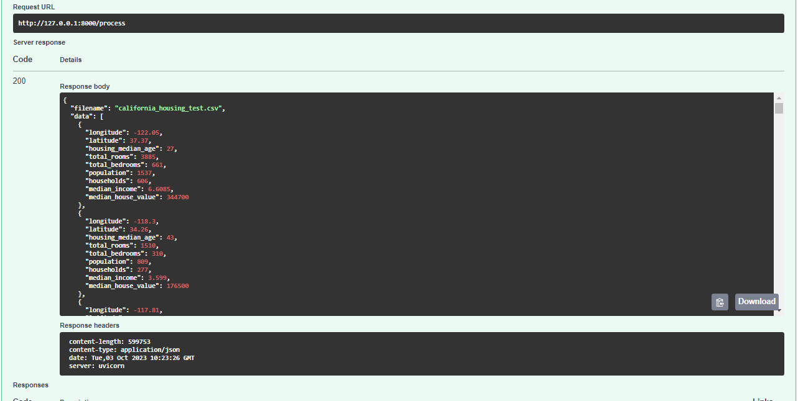
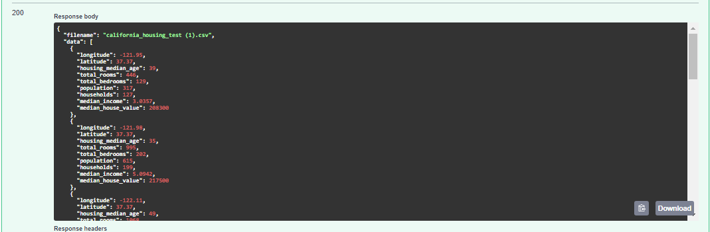
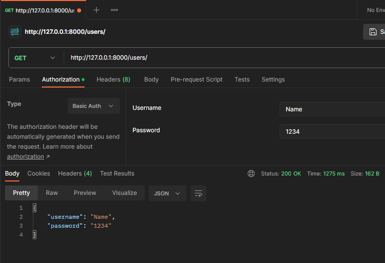

# project_FastAPI

Репозиторий на FastAPI. Задача которого является обработка файлов .csv для фильтрации и сортировки данных

1. Клонирование проекта: git clone https://github.com/OlzhasKALIEV/project_FastAPI.git
2. Установка виртуального окружения: python -m venv venv
3. Запуск виртуального окружения: .\venv\Scripts\activate
4. Запуск сервера: docker-compose up

Базовая авторизация пользователя

GET: http://0.0.0.0:8000/users/

Postman

Обработка в интерактивной документации API
GET: http://127.0.0.1:8000/docs#/default

Информация о столбцах 

Обработка url в Postman

file: файл данных, который вы хотите обработать

POST: http://0.0.0.0:8000/table

Обработка в интерактивной документации API

file: файл данных, который вы хотите обработать

POST: http://127.0.0.1:8000/docs#/default/upload_file_table_post

POST: http://0.0.0.0:8000/process?filter_column=latitude&filter_value=37.37&sort_columns=total_rooms

file: файл данных, который вы хотите обработать

filter_column: имя столбца, по которому нужно выполнить фильтрацию (если не требуется фильтрация, оставьте это поле пустым) 

filter_value: значение, по которому нужно выполнить фильтрацию (если не требуется фильтрация, оставьте это поле пустым)

sort_columns: имена столбцов для сортировки, разделенные запятыми (если не требуется сортировка, оставьте это поле пустым)

Обработка url в Postman

Обработка в интерактивной документации API

POST: http://127.0.0.1:8000/docs#/default/process_file_process_post

file: файл данных, который вы хотите обработать

filter_column: имя столбца, по которому нужно выполнить фильтрацию (если не требуется фильтрация, оставьте это поле пустым) 

filter_value: значение, по которому нужно выполнить фильтрацию (если не требуется фильтрация, оставьте это поле пустым)

sort_columns: имена столбцов для сортировки, разделенные запятыми (если не требуется сортировка, оставьте это поле пустым)

Обработка url в Postman

POST: http://0.0.0.0:8000/process

