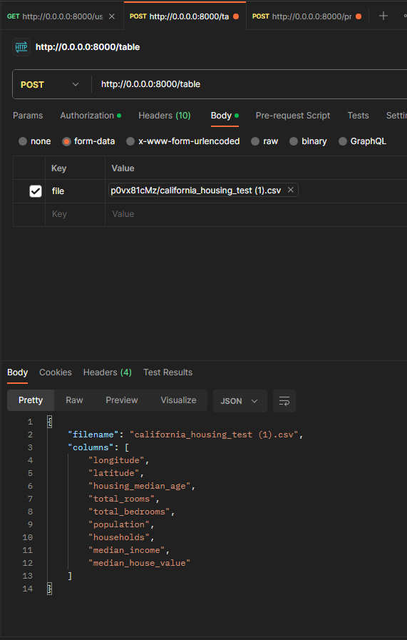
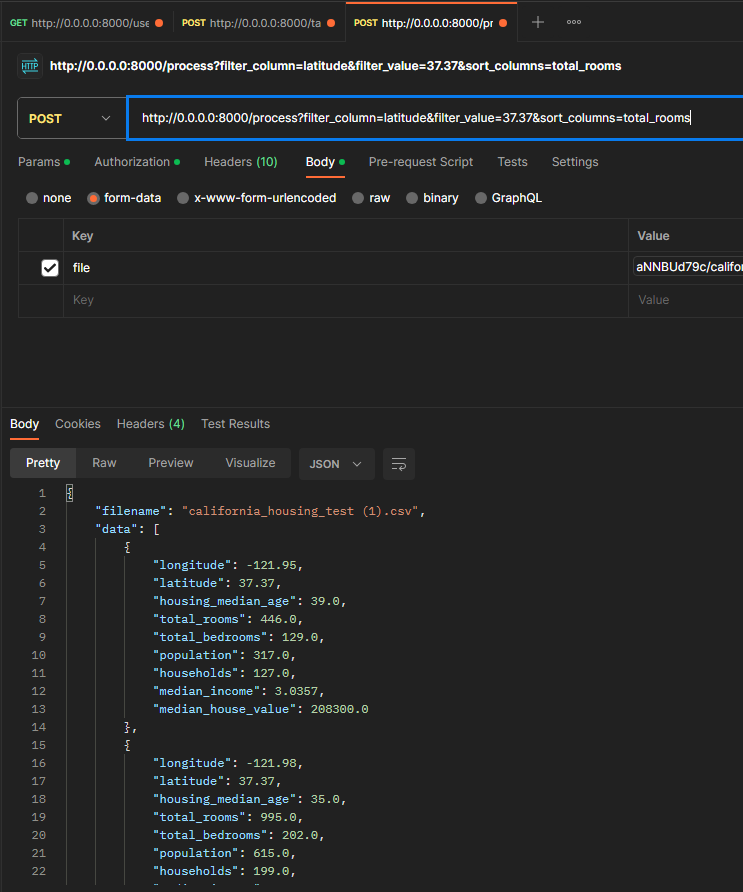
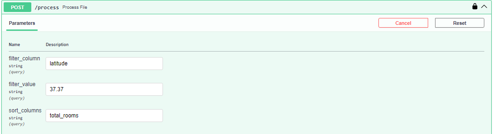

# project_FastAPI

Репозиторий на FastAPI. Задача которого является обработка файлов .csv для филтрации и сортировки данных

1. Клонирование проекта: git clone https://github.com/OlzhasKALIEV/project_FastAPI.git
2. Установка виртуального окружения: python -m venv venv
3. Запуск виртуального окружения: .\venv\Scripts\activate
4. Установка зависимостей: pip install -r .\requirements.txt
5. Запуск сервера: uvicorn main:app --reload

Информация о столбцах 

Обработка url в Postman

POST: http://127.0.0.1:8000/table

Обработка в интерактивной документации API

POST: http://127.0.0.1:8000/process?filter_column=latitude&filter_value=37.37&sort_columns=total_rooms

Обработка url в Postman

Обработка в интерактивной документации API

file: файл данных, который вы хотите обработать

filter_column: имя столбца, по которому нужно выполнить фильтрацию (если не требуется фильтрация, оставьте это поле пустым) 

filter_value: значение, по которому нужно выполнить фильтрацию (если не требуется фильтрация, оставьте это поле пустым)

sort_columns: имена столбцов для сортировки, разделенные запятыми (если не требуется сортировка, оставьте это поле пустым)

Обработка url в Postman

POST: http://127.0.0.1:8000/process

Обработка в интерактивной документации API

